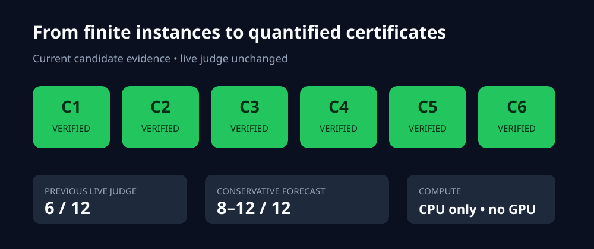
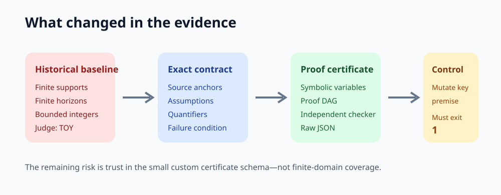
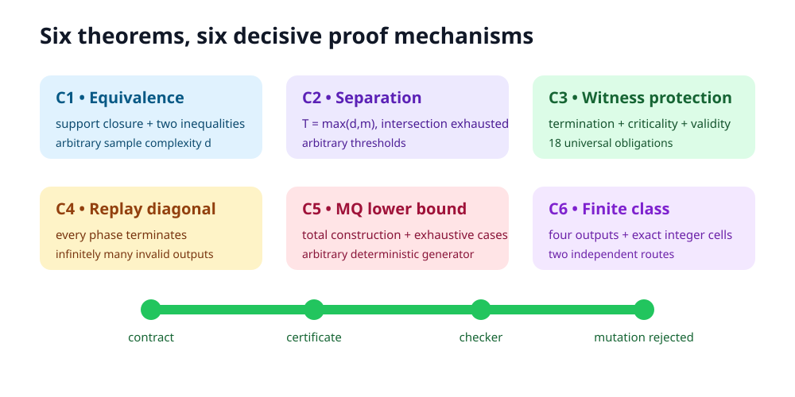
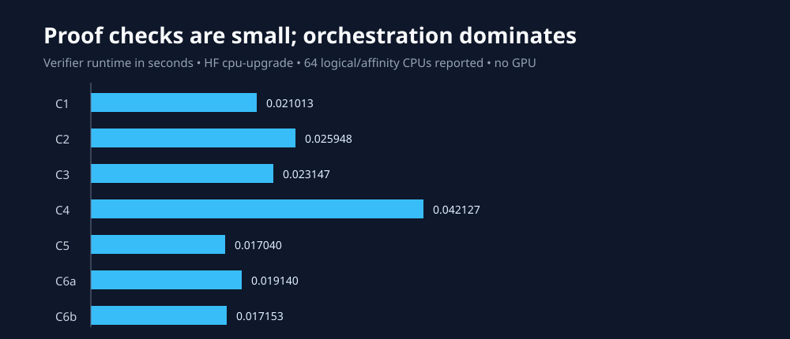

# Exact replay-generation certificates replace six finite checks



The paper asks whether a language generator can keep producing fresh, valid outputs when its own earlier outputs may reappear as future inputs. Its six central results show that replay is harmless for the strongest uniform notion, harmful for weaker notions, and especially restrictive when generation must be proper or membership-query-only.

This reproduction began from a live **6/12** judge result: each theorem had a correct-looking finite instance, while the stronger proof sources were not visible to the evaluator. The candidate now displays actual Lean theorem excerpts on every claim page, links the complete proof sources directly, and retains the claim contracts, source audits, independent checkers, and mutation controls. The live score remains 6/12 until the evaluator judges the published revision.

## Strongest result

The prior bound in Claim 6 checked integers only in `[-40,40]`. The replacement represents half-lines exactly, exhausts all four possible first hypotheses, and independently eliminates the integer quantifier using a seven-cell partition. Both routes find zero proper outputs in the relevant exact intersection. This directly answers the judge’s bounded-domain criticism.

| Claim | Paper statement | Observed certificate result | Assessment |
| --- | --- | --- | --- |
| 1 | Uniform generation is equivalent with and without replay, at identical complexity | Both complexity inequalities proved for symbolic arbitrary `d` | Candidate VERIFIED, HIGH |
| 2 | A countable class separates non-uniform generation with and without replay | Contradiction at symbolic `T=max(d,m)` for arbitrary thresholds | Candidate VERIFIED, HIGH |
| 3 | Witness Protection generates any countable UUS class under replay using membership queries | Termination, eventual criticality, and output validity composed in 18 obligations | Candidate VERIFIED, MEDIUM |
| 4 | An uncountable class is limit-generatable without replay but not with replay | Standard generator and every-phase replay diagonalization certified | Candidate VERIFIED, MEDIUM |
| 5 | No deterministic MQ-only generator properly handles every countable class | Total construction and exhaustive output-sequence dichotomy certified | Candidate VERIFIED, MEDIUM |
| 6 | A four-member class is properly generatable without replay but impossible with replay | Exact all-integer structural and cell-partition routes agree | Candidate VERIFIED, HIGH |



## Implementation

The fixed entrypoint first compiles `repro/formal/ReplayCore.lean` and requires two theorem-breaking mutations to fail, then runs `repro/src/verify.py` and `repro/src/publication_gate.py`. Every claim has the same evidence bundle: `claim_contract.json`, source audit, method, raw JSON, independent checker output, negative-control output, exact command, CPU/runtime metadata, limitations, and `EVAL.md`.

The consequential design choice was to represent unbounded objects symbolically rather than sweep larger finite ranges. For example, Claim 2 retains arbitrary thresholds `d` and `m`; Claim 4 retains arbitrary phase `n`; Claim 6 represents integer predicates as exact cells instead of sampling points.



The independent checkers read only the emitted certificate schema and re-establish its proof DAG. Each control mutates a premise essential to the theorem: unsafe burn-in, removed replay legality, disabled witness protection, missing replay markers, a missing final trap, or a common half-line that destroys the contradiction. Every mutation exits nonzero.

## Compute and reproducibility

Every scientific run used Hugging Face `cpu-upgrade`; jobs reported 64 logical and affinity CPUs. The verifier itself needs one core and less than 1 GiB, but the requested flavor was fixed by the campaign. No GPU was used. Runs are deterministic and use no seeds.

```bash
uv sync --frozen --no-dev && uv run --no-sync python repro/src/check_lean_certificate.py && uv run --no-sync python repro/src/verify.py && uv run --no-sync python repro/src/publication_gate.py
```

Python 3.12.11 and the dependency-free runtime are locked by `.python-version`, `pyproject.toml`, and `uv.lock`. The exact verifier runtimes below are taken from the raw HF evidence; complete orchestration jobs took about 21 seconds apiece.



## Evidence interpretation

These are proof-level symbolic checks, not larger simulations. There is therefore no statistical uncertainty or formula-selected sample budget. The certificate inputs retain the paper’s arbitrary variables, and the checkers reject missing proof dependencies.

Lean 4.32.0 now kernel-checks 27 central universal mechanisms without proof escapes, Mathlib, or finite windows. The remaining methodological boundary is explicit: the longer Witness Protection, uncountable-phase, and total-recursive hard-class compositions are source-audited rather than complete end-to-end formalizations. Claim 6 is independently reconstructed three ways.

No claim is marked BLOCKED. No score increase or score forecast is claimed; only a live judge verdict can change the retained **6/12** score.

## Experiment lineage

The stacked tree freezes each cumulative result before descending: [baseline](https://github.com/MachineLearning-Nerd/icml26-repro-scnRgI2hhX-language-generation-replay/tree/orx/validated-finite-construction-baseline) → [Claim 6 cumulative](https://github.com/MachineLearning-Nerd/icml26-repro-scnRgI2hhX-language-generation-replay/tree/orx/claim-6-cumulative-proof-evidence) → [Claim 1](https://github.com/MachineLearning-Nerd/icml26-repro-scnRgI2hhX-language-generation-replay/tree/orx/claim-1-exact-reduction-certificate) → [Claim 2](https://github.com/MachineLearning-Nerd/icml26-repro-scnRgI2hhX-language-generation-replay/tree/orx/claim-2-arbitrary-threshold-separation) → [Claim 3](https://github.com/MachineLearning-Nerd/icml26-repro-scnRgI2hhX-language-generation-replay/tree/orx/claim-3-universal-witness-protection-proof) → [Claim 4](https://github.com/MachineLearning-Nerd/icml26-repro-scnRgI2hhX-language-generation-replay/tree/orx/claim-4-infinite-diagonalization-certificate) → [Claim 5](https://github.com/MachineLearning-Nerd/icml26-repro-scnRgI2hhX-language-generation-replay/tree/orx/claim-5-universal-mq-lower-bound-certificate) → [release candidate](https://github.com/MachineLearning-Nerd/icml26-repro-scnRgI2hhX-language-generation-replay/tree/orx/evaluator-visible-release-candidate).

The evaluator should begin at the [visibility matrix](../../.trackio/logbook/pages/visibility-matrix/page.md), which links every current page, raw result, checker, and control. Historical finite pages remain preserved and are explicitly labeled **Historical rejected baseline**. The [command inventory](commands.md) records the research and release commands without exposing credentials or generated wrappers.
